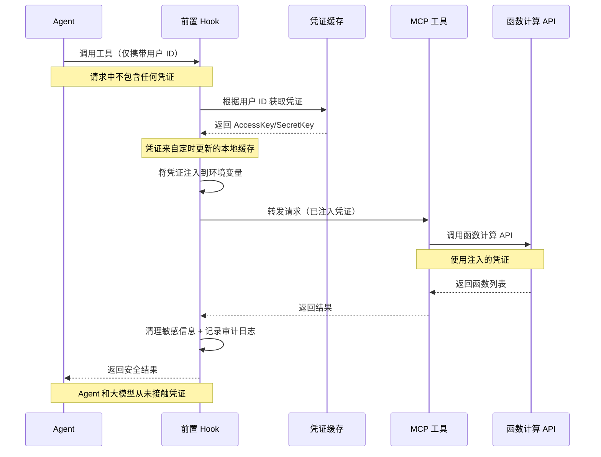

# AgentRun 探秘：凭证管理让凭证下发更简单

在构建 Agent 应用时，凭证管理是一个容易被忽视但又极其重要的问题。一个典型的 Agent 应用会面临两个方向的凭证需求：**向内，用户如何安全地调用你的 Agent？向外，Agent 如何安全地调用外部服务？**

传统做法存在诸多问题。硬编码在代码里容易泄露且难以更新，存在配置文件中同样有安全风险，每次都手动传递不仅麻烦还容易出错，让大模型处理凭证更是巨大的安全隐患。更棘手的是，当凭证需要更新时（比如 API Key 过期、权限变更），如何在不重启服务的情况下动态更新？AgentRun 的凭证管理系统就是为了解决这些问题而生。


## 入站凭证与出站凭证：双向安全保障
AgentRun 的凭证管理分为两个维度，分别解决"谁能调用我"和"我能调用谁"的问题。

### 入站凭证：控制谁能访问你的 Agent


入站凭证用于控制外部用户或系统如何访问你的 Agent 应用。当你创建一个 Agent 并对外提供服务时，需要确保只有授权的用户才能调用。AgentRun 提供了灵活的入站凭证管理，可以为不同的调用方生成独立的凭证，设置不同的权限和配额，控制每个凭证能访问哪些 Agent、调用频率限制、有效期等。

**由于所有请求都经过 AgentRun 网关，入站凭证可以实现真正的动态更新。**比如你的 Agent 对外提供客服能力，可以为不同的业务部门生成不同的入站凭证，每个部门只能访问各自授权的 Agent。当某个部门的凭证泄露时，可以立即撤销并重新生成，所有变更在网关层实时生效，不影响其他部门的使用，也无需重启任何服务。

### 出站凭证：安全调用外部服务


出站凭证用于 Agent 访问外部服务时的身份认证。Agent 应用通常需要调用各种外部服务：大模型 API（OpenAI、Claude、Qwen 等）、数据库、第三方工具、企业内部系统等，每个服务都需要相应的凭证。传统方式下，开发者要么把这些凭证硬编码在代码里，要么通过环境变量传递，不仅不安全，更新时还需要重启服务。

Ag**entRun 采用了一套巧妙的定时查询与缓存机制来管理出站凭证。**所有出站凭证统一存储在加密的凭证库中，代码里不再出现任何敏感信息。Agent 启动时会从凭证库拉取所需的所有凭证并缓存到本地，运行过程中直接使用本地缓存，避免频繁的网络请求带来的性能开销。同时，系统会定期进行健康检查，主动查询凭证是否有更新，发现变更时只更新发生变化的凭证。如果健康检查失败，会自动重试，确保凭证始终可用。


**这种定时查询方案带来了多重价值。**从性能角度看，本地缓存避免了每次调用都查询凭证库，大幅降低了延迟和网络开销；从可用性角度看，即使凭证服务短暂不可用，缓存的凭证仍然可用，不会影响 Agent 的正常运行；从安全性角度看，定时健康检查确保凭证泄露或过期时能在几分钟内完成更新，而不需要等到下次部署。**最关键的是，整个更新过程对 Agent 代码完全透明，开发者无需编写任何凭证更新逻辑，专注于业务实现即可。**

这种最终一致性的设计在实践中被证明是最优的平衡：既保证了性能和可用性，又实现了凭证的动态更新能力。相比于每次都实时查询（性能差）或者只在启动时加载（更新不及时），定时查询方案在三者之间找到了最佳平衡点。

## 实际应用：工具和模型的凭证配置
AgentRun 的凭证管理在两个关键场景发挥作用，展示了从理论到实践的完整闭环。

### 场景一：大模型调用的凭证管理
当你的 Agent 需要调用多个大模型时，每个模型都需要各自的 API Key。以前你可能需要在代码里硬编码这些 Key，或者通过环境变量传递，但这样做存在安全风险且更新困难。**有了 AgentRun 的凭证管理，你只需要在平台上配置各个模型的出站凭证，给每个凭证命名**（如 `openai_key`、`qwen_key`），**然后在 Agent 配置中引用这些凭证名称。**

运行时系统会自动注入实际的 Key，你的代码里完全看不到任何敏感信息。当某个模型的 Key 过期需要更新时，只需在凭证管理界面更新，几分钟后所有使用该凭证的 Agent 会通过定时健康检查自动获取新的 Key，无需修改代码或重启服务。这种体验就像是有一个智能管家在后台默默地帮你管理所有的钥匙，你只需要告诉他你要开哪扇门。

```yaml
# Agent 配置示例（伪代码）
models:
  - name: gpt-4
    credential: ${credentials.openai_key}  # 引用凭证名称，不暴露实际Key
  - name: qwen-max
    credential: ${credentials.qwen_key}
```

### 场景二：工具调用的凭证注入
回到之前提到的 FunctionQ 案例，这是一个更复杂但也更能体现凭证管理价值的场景。Agent 需要通过 MCP 调用 CLI 工具查询用户的函数计算资源，这些工具需要用户的 AccessKey 和 SecretKey。**关键问题是：如何在不暴露凭证给大模型的前提下，让工具能够正确调用 API？**

**AgentRun 通过前置 Hook 实现了优雅的动态凭证注入。**用户在平台上配置自己的出站凭证后，Agent 调用工具时请求中只携带用户 ID，不包含任何凭证信息。前置 Hook 拦截请求，根据用户 ID 从凭证库获取对应的凭证，然后将凭证注入到环境变量或请求参数中。工具使用注入的凭证执行实际操作，后置 Hook 再清理敏感信息并记录审计日志。**整个过程中，凭证从未暴露给大模型，也不会出现在 Agent 的代码中，真正做到了安全可控。**



## 核心价值：让开发者专注业务逻辑
AgentRun 的凭证管理系统带来的价值远不止"管理凭证"这么简单。从安全性角度看，凭证不再出现在代码和日志中，集中加密存储大幅降低泄露风险，即使某个凭证泄露也可以快速撤销和更换。从开发效率角度看，开发者不需要关心凭证如何存储、如何传递、如何更新，只需在配置中引用凭证名称，系统自动处理剩下的事情。从运维角度看，凭证更新不需要修改代码、不需要重新部署、不需要重启服务，在管理界面更新后通过定时机制自动生效。

**更重要的是，凭证管理让 Agent 应用从"能用"变成"敢用"**。企业不再担心凭证泄露的风险，不再为凭证更新而头疼，不再因为安全问题而犹豫是否将 Agent 应用部署到生产环境。这种信心的建立，才是凭证管理最大的价值所在——它消除了企业拥抱 AI Agent 的最后一道顾虑，让技术真正为业务创造价值。

