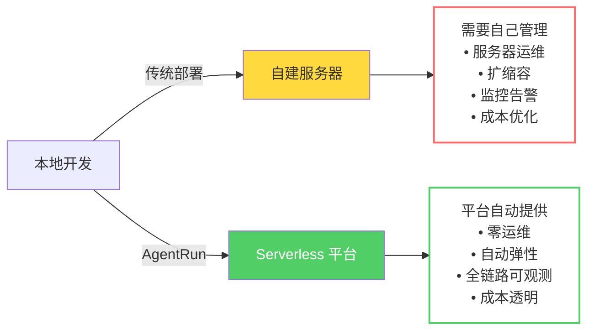

# AgentRun 探秘：如何把 LangChain 等框架部署到 AgentRun 上

当您已经用 LangChain、AgentScope、LangGraph 等框架开发了 Agent 应用，如何让它们享受 AgentRun 提供的 **Serverless 运行时、企业级 Sandbox、模型高可用、全链路可观测** 等能力？好消息是，**您几乎不需要改动现有代码，只需要简单的适配就可以迁移到 AgentRun。**

这篇文章将通过真实的代码示例，展示如何将不同框架的 Agent 应用部署到 AgentRun 上，以及如何充分利用 AgentRun 的各种能力。

## 为什么要部署到 AgentRun？
在讨论具体的集成方案前，让我们先明确一个问题：**如果您的 Agent 应用已经在本地或自建服务器上运行良好，为什么还要迁移到 AgentRun？**

答案很简单：**从开发环境到生产环境，有一道巨大的鸿沟。** 本地运行只需要考虑功能实现，但生产环境需要考虑性能、稳定性、成本、安全、可观测等一系列问题。AgentRun 提供的不是又一个 Agent 框架，而是让您的 Agent 能够以企业级标准运行的完整基础设施。

具体来说，部署到 AgentRun 后，您能获得：零运维的 Serverless 运行时（自动扩缩容、按量付费），企业级的 Sandbox 环境（高性能、安全隔离），模型高可用保障（自动熔断、多模型 Fallback），全链路可观测（完整的 Trace、成本归因），以及统一的工具和 MCP 管理。



## 快速上手：5分钟部署您的第一个 LangChain Agent
让我们从最流行的 LangChain 框架开始，通过一个完整的例子展示如何将 LangChain Agent 部署到 AgentRun。

### 第一步：安装 Serverless Devs
AgentRun 使用 Serverless Devs 作为部署工具。如果您有 Node.js 环境，一行命令即可安装：

```bash
npm i -g @serverless-devs/s
```

### 第二步：创建项目
使用脚手架快速创建项目（注意：需要 Python 3.10 及以上版本）：

```bash
# 初始化模板
s init agentrun-quick-start-langchain

# 进入代码目录
cd agentrun-quick-start-langchain/code

# 初始化虚拟环境并安装依赖
uv venv && uv pip install -r requirements.txt
```

### 第三步：全局参数配置
通过环境变量（建议使用 `.env` 文件）配置您的 AgentRun 访问凭证：

```bash
export AGENTRUN_ACCESS_KEY_ID="your-access-key-id"
export AGENTRUN_ACCESS_KEY_SECRET="your-access-key-secret"
export AGENTRUN_ACCOUNT_ID="your-account-id"
export AGENTRUN_REGION="cn-hangzhou"
```

### 第四步：理解集成方式
这是最关键的部分。打开生成的代码，您会看到集成非常简单：

```python
from agentrun.integration.langchain import model, sandbox_toolset
from agentrun.server import AgentRunServer

# 使用 AgentRun 的模型（自动享受高可用、熔断等能力）
llm = model("<your-model-name>")

# 使用 AgentRun 的 Sandbox 工具
tools = sandbox_toolset(
    template_name="<your-sandbox-name>",
    template_type=TemplateType.CODE_INTERPRETER,
    sandbox_idle_timeout_seconds=300,
)

# 创建 LangChain Agent（和原来的代码完全一样）
agent = create_agent(
    model=llm,
    tools=tools,
    system_prompt="您是一个智能助手"
)

# 定义调用函数
def invoke_agent(request):
    result = agent.invoke({"messages": request.messages})
    return result["messages"][-1].content

# 启动 HTTP Server（提供 OpenAI 兼容的 API）
AgentRunServer(invoke_agent=invoke_agent).start()
```

**核心要点：**

+ `model()` 函数返回的是 LangChain 可以直接使用的模型对象
+ `sandbox_toolset()` 返回的是 LangChain Tools 列表
+ 您的 Agent 创建代码**完全不需要改动**
+ `AgentRunServer` 自动处理 HTTP 请求，提供标准的 OpenAI API

### 第五步：本地测试
启动服务后，可以通过 HTTP 请求测试：

```bash
curl 127.0.0.1:9000/v1/chat/completions \
  -X POST \
  -H "content-type: application/json" \
  -d '{"messages": [{"role": "user", "content": "通过代码查询现在是几点?"}], "stream":true}'
```

### 第六步：部署到生产环境
项目中已经包含了 `s.yaml` 配置文件。您只需要修改其中的 `role` 字段为您的阿里云角色：

```yaml
role: acs:ram::{您的阿里云主账号 ID}:role/{您的阿里云角色名称}
```

配置部署密钥：

```bash
s config add
# 按照引导输入 Access Key ID 和 Secret，记住密钥对名称（如 agentrun-deploy）
```

执行部署：

```bash
s deploy -a agentrun-deploy
```

部署完成后，您会得到一个 HTTPS URL，就可以在生产环境调用您的 Agent 了。

## 不同框架的集成案例
AgentRun 不仅支持 LangChain，还深度集成了主流的 Agent 开发框架。**所有框架都遵循同样的理念：通过简单的适配层，让您的代码无缝迁移到 AgentRun，享受企业级能力。**

### LangGraph：工作流编排
LangGraph 是 LangChain 团队推出的工作流编排框架，适合构建复杂的多步骤 Agent。集成方式和 LangChain 类似：

```python
from agentrun.integration.langgraph import model, tools
from langgraph.graph import StateGraph, MessagesState
from langgraph.prebuilt import ToolNode

# 使用 AgentRun 的模型和工具
llm = model("<your-model-name>").to_langgraph()
agent_tools = tools()

# 构建 LangGraph 工作流（和原来的代码一样）
def call_model(state: MessagesState):
    messages = state["messages"]
    response = llm.invoke(messages)
    return {"messages": [response]}

workflow = StateGraph(MessagesState)
workflow.add_node("agent", call_model)
workflow.add_node("tools", ToolNode(agent_tools))
workflow.set_entry_point("agent")

# 定义条件边...
app = workflow.compile()

# 调用
result = app.invoke({"messages": [HumanMessage(content="查询上海天气")]})
```

**LangGraph 的优势**是可以精确控制 Agent 的执行流程，比如条件分支、循环、并行执行等。部署到 AgentRun 后，这些复杂的工作流都能自动享受弹性伸缩和可观测能力。

### AgentScope：多智能体协作
AgentScope 是阿里达摩院开源的多智能体框架，特别适合构建多Agent协作场景。集成方式：

```python
from agentrun.integration.agentscope import model, tools
from agentscope.agent import ReActAgent
from agentscope.tool import Toolkit

# 使用 AgentRun 的模型和工具
llm = model("<your-model-name>").to_agentscope()
agent_tools = tools()

# 注册工具到 Toolkit
toolkit = Toolkit()
for tool in agent_tools:
    toolkit.register_tool_function(tool)

# 创建 Agent（和原来的代码一样）
agent = ReActAgent(
    name="assistant",
    sys_prompt="您是一个智能助手",
    model=llm,
    toolkit=toolkit,
)

# 调用
result = await agent.reply(Msg(name="user", content="查询上海天气", role="user"))
```

**AgentScope 的优势**是对多Agent系统的原生支持，包括Agent之间的通信、协调、记忆共享等。部署到 AgentRun 后，每个 Agent 都在独立的隔离环境中运行，确保安全性。

### PydanticAI：类型安全的 Agent 框架
PydanticAI 是一个新兴框架，强调类型安全和结构化输出。集成方式：

```python
from agentrun.integration.pydantic_ai import model, tools
from pydantic_ai import Agent

# 使用 AgentRun 的模型和工具
llm = model("<your-model-name>").to_pydantic_ai()
agent_tools = tools()

# 创建 Agent
agent = Agent(
    llm,
    instructions="Be concise, reply with one sentence.",
    tools=agent_tools,
)

# 同步调用
result = agent.run_sync("上海的天气如何？")

# 异步调用
result = await agent.run("上海的天气如何？")
```

**PydanticAI 的优势**是强类型和结构化输出，特别适合需要严格数据验证的企业场景。

## 充分利用 AgentRun 的核心能力
将 Agent 部署到 AgentRun 后，您不仅获得了 Serverless 运行环境，还可以深度利用平台提供的各种企业级能力。

### 模型高可用：告别单点故障
部署到 AgentRun 后，您的 Agent 自动享受模型高可用能力。当您配置的主模型出现故障、限流或超时时，系统会自动切换到备用模型，**整个过程对您的代码完全透明**。

在 AgentRun 控制台配置模型代理时，可以设置：主模型（如 GPT-4），备用模型列表（如 Claude-3、Qwen-Max），熔断策略（错误率阈值、超时时间），负载均衡策略（轮询、权重、最少连接）。

**您的代码完全不需要改动**，只需要在创建模型时使用 AgentRun 的模型名称，所有的容错、切换、负载均衡都由平台自动处理。

### 企业级 Sandbox：安全执行代码
AgentRun 提供的 Sandbox 不是简单的代码执行环境，而是**企业级的安全隔离沙箱**。每个 Sandbox 实例都是独立隔离的，支持多种执行类型：

Code Interpreter 支持 Python、Node.js、Java、Bash 等语言，可以执行数据分析、文件处理等任务。Browser Tool 提供浏览器自动化能力，支持网页爬取、表单填写、截图等操作。All In One 集成了代码解释器和浏览器工具，提供更丰富的交互能力。

使用时，通过 `sandbox_toolset()` 函数就可以获取相应的工具集合，这些工具会自动转换为您使用的框架所需的格式。

### 工具和 MCP：标准化集成
AgentRun 提供统一的工具管理和 MCP（Model Context Protocol）机制。您可以从工具市场选择现成的工具，也可以自定义工具并发布到市场。

更强大的是 **MCP 的 Hook 机制**。通过前置 Hook，可以在工具调用前自动注入用户凭证、记录请求日志、校验参数合法性。通过后置 Hook，可以对结果进行转换、记录审计日志、处理异常情况。这些通用逻辑不需要在每个工具中重复实现，大大提升了开发效率。

### 全链路可观测：不再是黑盒
这是 AgentRun 最强大的能力之一。**您的代码不需要做任何改动，平台会自动记录 Agent 的完整执行链路**。

在可观测平台上，您可以看到：Agent 接收到用户请求的时间和内容，调用了哪个模型、使用了多少 Token、花费了多少钱，调用了哪些工具、每个工具的执行时间和结果，访问了哪些知识库、检索了多少数据，每个环节的耗时分布，完整的调用链 Trace。

**这些能力都是平台自动提供的**，通过探针注入实现，无论是高代码还是低代码创建的 Agent，都自动享受这些可观测能力。

### 记忆和知识库：数据不出域
AgentRun 深度集成了 RAGFlow、Mem0 等开源项目，提供灵活的记忆和知识库管理。您可以选择一键托管模式，由平台统一管理部署运维，享受 Serverless 的弹性和按量付费优势。也可以选择绑定模式，将 Agent 连接到已经部署在企业 VPC 或 IDC 内的实例，**数据完全不出企业内网**。

这种灵活性让您可以根据数据的敏感级别选择不同的策略：核心业务数据私有化部署，一般数据托管上云，在安全性和便利性之间找到最佳平衡。

