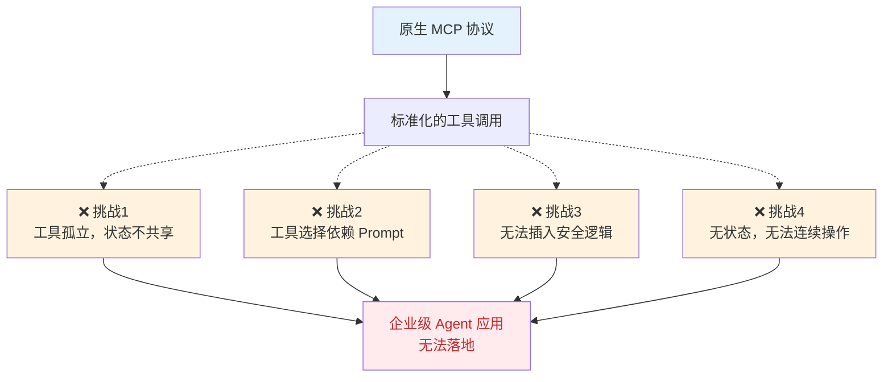
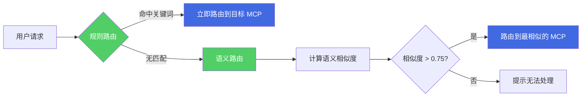
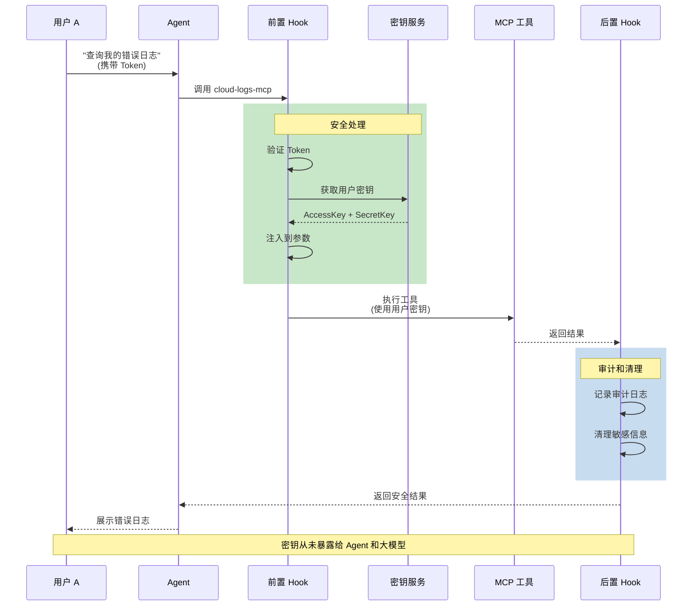
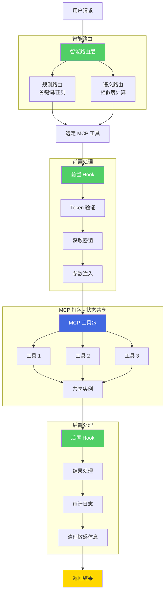

# AgentRun 探秘：为什么要对 MCP 做进一步的拓展（智能路由，规则路由，Hook能力）

MCP（Model Context Protocol）正在成为 Agent 应用中工具调用的事实标准。它提供了一套统一的协议，让 Agent 可以标准化地调用各种工具和 API。但当我们真正开始构建企业级 Agent 应用时，发现**原生 MCP 协议解决了"如何调用"的问题，却没有解决"如何用好"的问题。**

## 企业级 Agent 应用面临的四大挑战
### 挑战一：相关工具太多，配置和管理成本高
用户说"写一段代码读取 data.csv 文件，处理后保存为 result.csv"。系统提供了代码解释器 Sandbox，包含多个独立的工具：`execute_code` 执行代码、`upload_file` 上传文件、`download_file` 下载文件、`delete_file` 删除文件、`list_files` 列出文件等。

问题是什么？ 每个工具都需要单独配置 Sandbox 参数（超时时间、环境变量、资源限制等），5 个工具就要配置 5 次，容易遗漏或不一致。在 Agent 配置中需要逐一声明这 5 个工具，管理起来很繁琐。当 Sandbox 参数需要调整时（比如增加超时时间），需要修改 5 处配置。更头疼的是，Agent 的 Prompt 需要详细描述这 5 个工具的用途和使用方法，Prompt 变得冗长复杂。

**本质问题：原生 MCP 把一个完整能力拆成了多个孤立工具，但这些工具本应作为一个整体被使用和管理。**

### 挑战二：工具越来越多，Agent 不知道该用哪个
平台上有几十个甚至上百个 MCP 工具：`code-executor-mcp`、`browser-automation-mcp`、`cloud-logs-mcp`、`database-query-mcp`……当用户发起请求，Agent 如何选择？

传统做法是在 Prompt 中详细描述每个工具的用途，让大模型自己判断。但这会导致：Prompt 过长影响理解和成本；更致命的是，无法处理模糊请求——用户说"跑个脚本"、"看看服务有没有问题"，这些表达没有明确关键词，单纯靠 Prompt 描述很难准确匹配。

**本质问题：原生 MCP 是纯协议，不关心"该用哪个工具"，只关心"如何调用工具"。**

### 挑战三：需要用户的云服务密钥，但绝对不能暴露
构建云厂商智能助手，用户 A 说"查询我的错误日志"，需要调用云厂商 API，这需要用户 A 的 AccessKey 和 SecretKey。密钥不能硬编码（每个用户不同），不能让 Agent 持有（安全风险），不能让用户每次输入（体验差），也不能明文存储（合规风险）。

**需要的是：在工具调用前动态获取并注入密钥，调用后清理痕迹，全程对 Agent 和大模型透明，还要记录审计日志满足合规要求。**

**本质问题：原生 MCP 没有提供在工具调用前后插入自定义逻辑的机制。**

---

这四大挑战可以总结为一个核心问题：**原生 MCP 提供了标准化的调用协议，但缺乏企业级场景所需的工具协作、智能选择、安全治理和状态管理能力。**



## AgentRun 的解决方案：三大扩展机制
面对这些挑战，AgentRun 对 MCP 进行了三个方向的深度扩展，每个扩展都是为了解决一类核心问题。

### 解决方案一：MCP 打包机制 - 让工具协作成为可能
**核心思路：将相关的工具打包成一个完整的能力单元，共享实例和状态。**

**如何实现？** 创建 MCP 工具时，指定类型（sandbox、browser、memory 等），配置参数，选择要包含的工具列表。所有包含的工具自动共享同一个底层实例。

```yaml
{
  "name": "code-executor-mcp",
  "type": "sandbox",
  "description": "完整的代码执行环境",
  "sandboxId": "sandbox-xxx",
  "includedTools": [
    "execute_code",
    "upload_file", 
    "download_file",
    "delete_file"
  ],
  "config": {
    "timeout": 30000,
    "pythonVersion": "3.10"
  }
}
```

**对于 Browser 的特殊支持：** Browser MCP 支持配置 CDP 端点，包含的 18 个浏览器工具（点击、输入、导航、截图等）自动共享同一个浏览器实例，保持 cookies 和 session。

```yaml
{
  "name": "browser-automation-mcp",
  "type": "browser",
  "config": {
    "cdpEndpoint": "ws://browser.example.com/cdp",
    "browser": "chrome",
    "viewportSize": "1280x720"
  },
  "includedTools": [
    "browser_navigate", "browser_type", 
    "browser_click", "browser_screenshot"
  ]
}
```

**解决了什么？** 配置集中管理，一次配置所有工具继承；状态自动共享，文件路径、环境变量在工具间保持；降低 Agent 复杂度，从"理解 4 个独立工具"变成"使用一个完整能力"。

### 解决方案二：智能路由 - 让工具选择自动化
**核心思路：通过规则路由和语义路由的组合，自动将用户请求匹配到最合适的 MCP 工具。**

**规则路由：处理明确意图**

配置关键词或正则表达式，快速匹配常见场景。

```yaml
routing:
  rules:
    - condition: 
        keywords: ["执行代码", "运行Python"]
      target: code-executor-mcp
    
    - condition:
        regex: ".*打开网页.*|.*浏览器.*"
      target: browser-automation-mcp
```

**语义路由：处理模糊意图**

当规则路由无法匹配时，使用 embedding 模型计算用户请求与每个 MCP 工具描述的语义相似度，选择最匹配的工具。

```yaml
semantic:
  enabled: true
  threshold: 0.75
  modelConfig:
    type: "system"
    modelName: "text-embedding-3-small"
```

**工作流程：**



**解决了什么？** 不需要在 Prompt 中描述所有工具，减轻大模型负担；规则路由快速处理常见场景，语义路由兜底处理边缘情况；支持自然语言多样性，用户怎么说都能匹配；降低 Token 成本，工具选择不消耗大模型资源。

### 解决方案三：Hook 机制 - 让企业级需求落地
**核心思路：在 MCP 调用前后提供标准化的拦截点，插入自定义逻辑。**

**前置 Hook：Token 换密钥并注入**

```javascript
async function beforeExecute(context) {
  const { token, params } = context;
  
  // 1. 验证 Token，获取用户身份
  const user = await TokenService.verify(token);
  
  // 2. 从密钥管理服务获取该用户的云服务密钥
  const credentials = await SecretManager.get(user.id, 'cloud-api');
  
  // 3. 动态注入到工具参数中
  params.accessKey = credentials.accessKey;
  params.secretKey = credentials.secretKey;
  
  return params;
}
```

**后置 Hook：审计和清理**

```javascript
async function afterExecute(context, result) {
  // 记录审计日志
  await AuditLog.create({
    userId: context.user.id,
    action: context.toolName,
    timestamp: Date.now()
  });
  
  // 清理敏感信息（如果结果中包含）
  delete result.credentials;
  
  return result;
}
```

**完整流程：**



**解决了什么？** 密钥零暴露，从未出现在 Agent、大模型、日志中；多租户自动隔离，每个用户获取各自的密钥；关注点分离，鉴权、凭证、审计等横切逻辑统一处理；满足合规要求，审计日志自动记录。

---

## AgentRun 的完整技术架构
三大扩展机制协同工作，形成完整的企业级 MCP 调用体系：



**协同工作流程：**

1. **智能路由层**：用户请求进来，先尝试规则路由快速匹配，如果没有命中则启用语义路由分析
2. **选定 MCP**：确定要调用哪个 MCP 工具
3. **前置 Hook**：验证身份、获取密钥、注入参数、记录日志
4. **MCP 打包**：调用工具包内的一个或多个工具，所有工具共享底层实例和状态
5. **后置 Hook**：处理结果、记录审计、清理敏感信息
6. **返回结果**：给 Agent 和最终用户

## 如何使用 AgentRun 的 MCP 能力
基于以上技术架构，AgentRun 提供了三种使用 MCP 的方式：

### 方式一：从工具市场直接使用


AgentRun 提供了工具市场，包含大量预制的 MCP 工具，涵盖代码执行、浏览器自动化、数据库查询、云服务操作等常见场景。**用户可以直接搜索、预览、一键添加**，无需从零配置。工具市场中的 MCP 都经过测试优化，包含完善的描述和示例。

**适用场景**：快速上线，使用标准能力，不需要深度定制。

### 方式二：导入已有 MCP 并通过代理增强


如果您已经有现成的 MCP 工具（开源社区的、第三方的、自己开发的），可以通过 **MCP 代理**导入到 AgentRun。

**MCP 代理的核心价值**：让原生 MCP 工具也能享受 AgentRun 的扩展能力。导入后自动获得：

+ Hook 支持（前置/后置处理）
+ 智能路由（参与规则和语义路由）
+ 统一治理（凭证管理、审计日志、监控告警）

**适用场景**：已有 MCP 工具，希望增强企业级能力，不想重复开发。

### 方式三：多个 API 打包成 MCP


AgentRun 支持**将多个相关的 API 打包成一个 MCP 工具**。比如云服务的多个 API：`ListFunctions`、`GetFunction`、`InvokeFunction`、`GetLogs`，可以打包成一个 `cloud-functions-mcp`。

打包时可以：

+ 配置统一的鉴权方式（通过 Hook）
+ 配置智能路由规则
+ 添加通用的错误处理和重试逻辑
+ 统一管理超时、限流等参数

**适用场景**：企业内部系统集成，把分散的 API 整合成 Agent 容易理解的能力单元。

AgentRun 对 MCP 的扩展，本质上是将 MCP 从一个工具调用协议升级为一个企业级的工具治理平台。

## 核心价值：从协议到平台的进化
MCP 打包让工具从孤立的能力点变成完整的能力单元，状态共享、配置统一。

智能路由让工具选择从手工配置 Prompt 变成系统自动决策，支持模糊意图和自然语言多样性。

Hook 机制让企业级需求（鉴权、凭证、审计、合规）从分散在各处的重复代码变成统一的治理策略。

MCP 代理让已有的原生 MCP 工具也能享受这些能力，不需要推倒重来。

工具市场和打包能力让 MCP 的创建、分享、复用变得简单，形成生态闭环。

更重要的是，这些扩展是渐进式的、非侵入的。您可以先用工具市场的现成 MCP 快速上线，随着需求复杂再导入自己的 MCP 并配置 Hook，最后将内部 API 打包成定制 MCP。每一步都有价值，每一步都不需要推倒重来。

当我们谈论 Agent 应用的企业级落地时，标准化的协议只是第一步，真正的挑战在于：**如何让工具好用、好管、好优化。**AgentRun 对 MCP 的扩展，正是在回答这个问题。从真实场景出发，提供完整的解决方案，这才是一个基础设施平台应有的价值。

