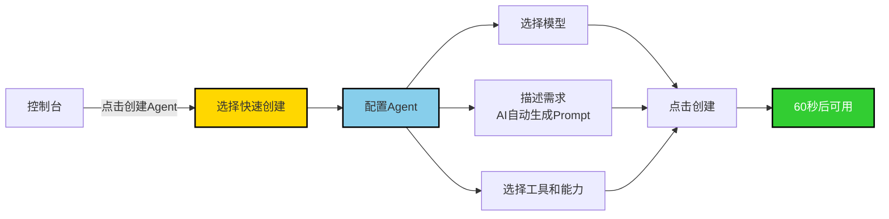
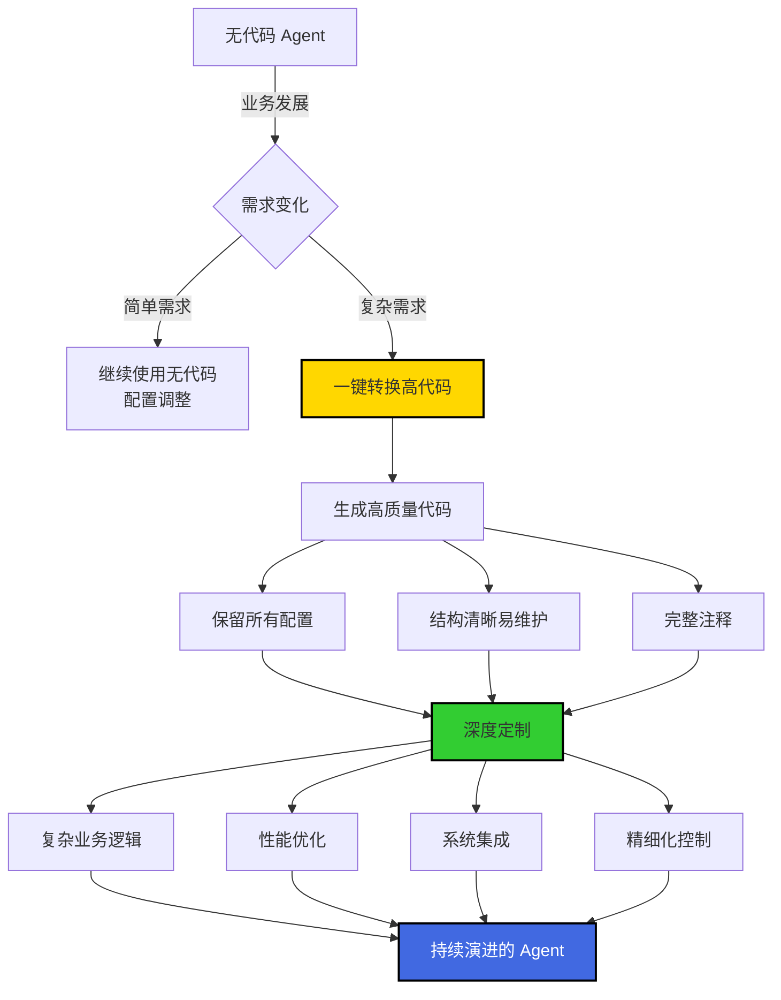

# AgentRun 探秘：通过无代码创建Agent，通过高代码更新Agent

当我们谈论 AI Agent 的开发时，常常面临一个两难的选择：**低代码平台上手快但缺乏灵活性，一旦需求复杂就束手无策；高代码开发虽然灵活但门槛高，业务人员无法参与，验证周期长。**能否鱼与熊掌兼得？

AgentRun 给出了答案：**通过无代码快速创建 Agent 验证想法，当业务发展需要更复杂定制时，一键转换为高代码继续演进。**这不是简单的功能堆砌，而是深刻理解了 Agent 应用从 0 到 1、从 1 到 100 的真实路径。

## 从想法到上线：60秒创建您的第一个 Agent
很多时候，最了解业务需求的是业务人员而不是技术人员，但传统的 Agent 开发需要编写大量代码，业务人员无法直接参与。**AgentRun 的无代码创建能力打破了这个限制。**

如图，创建一个 Agent 只需要三四个步骤：

**第一步：在控制台选择创建 Agent**  
进入 AgentRun 控制台，点击"创建 Agent"按钮。

**第二步：选择快速创建模式**  
在弹出的窗口中选择"快速创建"，平台会引导您通过简单的配置完成 Agent 创建。

**第三步：配置您的 Agent**  
这是核心步骤，您需要完成几个简单的配置：

+ **选择模型**：从 Qwen、Claude、GPT-4 等主流模型中选择，也可以选择企业自建的私有模型。不知道选哪个？平台会根据您的任务类型智能推荐。
+ **描述您的需求**：直接用自然语言描述您的需求，比如"我想要一个能帮用户查询订单状态的客服 Agent"。AgentRun 的 **AI 生成能力**会自动理解您的需求，生成合适的 Prompt 和配置。更进一步，平台提供 **Prompt AI 优化**功能，会自动分析您的提示词，给出优化建议，让 Agent 的效果更好。
+ **选择工具和能力**：从工具市场选择 Agent 需要的能力。需要执行代码？添加 Code Interpreter。需要操作浏览器？添加 Browser Tool。需要调用企业内部 API？从工具市场搜索或一键创建 MCP。值得注意的是，**Agent 本身、Sandbox、其他工具都可以以 MCP 形式提供**——这意味着您可以让一个 Agent 调用另一个 Agent 的能力，实现能力的组合和复用。

**第四步：点击创建**  
完成配置后，点击"创建"按钮，**60秒后，您的 Agent 就可以开始工作了。**

平台还支持**版本管理和灰度发布**，您可以安全地测试新版本，确认没问题后再全量发布。

> 除了快速创建，您还可以进行在线测试，并且可以进行多模型测试：  

>

## 业务发展，Agent 也要进化
快速创建的 Agent 运行了一段时间，业务量不断增长，需求也越来越复杂。您开始遇到这些问题：

+ 需要根据用户的历史行为做个性化推荐，但无代码配置无法实现复杂的逻辑判断
+ 需要对接企业内部复杂的业务系统，需要复杂的数据转换和错误处理
+ 需要对 Agent 的行为进行精细化控制，比如在特定条件下调用特定模型
+ 需要优化性能，减少不必要的模型调用以降低成本

**这时候，您需要的是代码级别的控制能力。**传统的低代码平台到了这一步就束手无策，您要么忍受功能受限，要么推倒重来用高代码重写整个 Agent。但 AgentRun 提供了第三条路：**一键转换为高代码。**

如图所示，转换过程非常简单：

1. 在 Agent 管理页面点击"转换为高代码"
2. 平台会自动生成高质量的 Python 代码
3. 代码结构清晰，包含完整的注释，易于理解和修改
4. 您可以选择在 AgentRun 的在线 IDE 中直接编辑，也可以下载到本地使用您喜欢的开发工具

**转换后的代码不是"垃圾代码"**，而是遵循最佳实践、结构清晰的高质量代码。它保留了您之前所有的配置（模型选择、Prompt、工具配置），并将它们转换为规范的代码结构。

## 高代码的深度定制能力
转换为高代码后，您进入了一个全新的世界。如图3所示，AgentRun 提供了完整的高代码开发环境。

让我们看一个真实的例子。假设您的客服 Agent 需要根据用户的VIP等级提供不同的服务策略。在无代码阶段，您只能配置统一的模型、Prompt 和工具，所有用户得到的都是相同的服务。但转换为高代码后，您可以实现精细化的个性化策略。

**转换为高代码后，您获得了完全的控制能力。**可以根据用户等级动态调整服务策略——VIP 用户使用更好的模型、更详细的 Prompt、更高优先级的响应速度，而普通用户则使用更经济的配置，在保证体验的前提下降低成本。可以实现智能成本优化，不再对所有请求都使用同一个模型，而是根据查询的复杂度、用户等级、历史行为等因素，动态选择最合适的模型。简单问题用小模型快速响应，复杂问题才使用大模型，实现成本和效果的最优平衡。

当然，可靠性和安全性也能得到全面增强。可以添加自动重试机制、超时控制、异常处理，当模型调用失败时自动切换到备用模型或返回预设的降级响应，确保服务始终可用。在返回结果前自动过滤敏感信息，添加内容审核，记录完整的审计日志。还可以实现多步骤的复杂业务流程，比如先查询用户历史订单，再根据订单状态决定下一步操作，最后整合多个数据源的信息给出综合建议。这些在无代码界面中难以实现的复杂逻辑，在高代码中都可以灵活实现。

## 更进一步：与 AgentRun 基础设施深度集成
转换为高代码后，您不仅可以编写业务逻辑，还可以深度利用 AgentRun 提供的各种基础设施能力。**这些能力通过简单的配置和调用就可以使用，您不需要自己实现复杂的基础设施。**

利用 AgentRun 的模型代理能力，您可以配置主模型和多个备用模型，启用熔断机制。当主模型出现问题时，系统会自动切换到备用模型，整个过程对用户透明，确保服务连续性。通过前置 Hook 可以在工具调用前自动注入用户凭证、记录请求日志、校验参数合法性；通过后置 Hook 可以对结果进行转换、记录审计日志、处理异常情况。这些通用逻辑不需要在每个工具中重复实现，只需配置一次即可。

对于耗时较长的操作，比如复杂数据分析、大文件处理，可以使用 AgentRun 的异步调用能力。Agent 不必阻塞等待，可以继续处理其他请求，当异步任务完成后通过回调通知结果。这种能力在构建高并发、高性能的 Agent 应用时尤为重要。

## 真实案例：FunctionQ 的演进之路

让我们回到第一篇文章提到的 FunctionQ 案例。这个函数计算智能助手的开发过程，诠释了从无代码到高代码的演进价值。

产品经理在第一天通过无代码界面快速创建了一个基础版本的 Agent，选择了 Qwen-Max 模型，配置了简单的 Prompt，从工具市场选择了"函数列表查询"、"函数详情查询"、"日志查询"等工具。当天下午，这个基础版本就上线了，开始服务内部测试用户。

第三天，测试用户开始反馈问题：Agent 调用工具时报"权限不足"错误，多个用户使用时数据混乱，成本增长很快但不知道花在哪里。这些问题在无代码界面无法解决，因为它们需要更复杂的逻辑控制。

**第五天，开发团队将 Agent 转换为高代码，问题迎刃而解。**通过配置 Hook 实现了动态凭证注入，根据用户 ID 自动获取对应的 AccessKey 和 SecretKey，在工具调用前注入到请求中，用户无感知但权限问题得到解决。利用 AgentRun 的会话亲和机制，确保同一用户的请求始终路由到同一实例，每个用户拥有独立的记忆存储，彻底隔离不同用户的数据。实现智能模型选择策略后，简单的列表查询使用 Qwen-Turbo，复杂的问题分析使用 Qwen-Max，在保持用户体验的前提下，成本降低了约 40%。

两周后，随着用户增长，团队继续优化。添加了智能缓存机制，相同的查询直接返回缓存结果，响应速度从 2 秒降到 0.1 秒。实现了多轮对话的上下文压缩，减少 Token 消耗。集成了企业内部的工单系统，Agent 可以自动创建和跟踪工单。根据问题类型实现了智能路由，自动分发到不同的专业 Agent。

**如果没有"无代码到高代码"的能力，这个项目会面临什么？**要么一开始就用高代码开发，验证周期从1天变成1周，错过最佳时间窗口。要么一直用无代码，无法解决权限、成本、性能等关键问题，最终不得不放弃。或者推倒重来，浪费前期所有积累，团队士气受挫。**AgentRun 让团队可以从最快的方式开始，随着业务发展平滑演进，没有技术债务，没有推倒重来。**

## 这不只是功能，更是理念
从无代码到高代码的演进能力，背后体现的是 AgentRun 对 Agent 应用开发的深刻理解。

**Agent 应用的开发不是线性的。**它不是从需求分析、设计、开发、测试、上线这样的瀑布流程。更多时候，它是一个快速验证、迭代优化、逐步完善的螺旋式过程。在想法验证阶段，您需要的是速度；在业务成熟阶段，您需要的是灵活性和控制力。没有一种工具能同时满足所有阶段的需求，但 AgentRun 通过"无缝演进"解决了这个问题。

**技术选择不应该是一次性的决定。**选择低代码就被锁定在低代码的能力边界内，选择高代码就要承受高门槛和漫长的开发周期。AgentRun 让您可以从最适合当前阶段的方式开始，随时根据需要演进到下一个阶段。更重要的是，这种演进是"零成本"的——转换为高代码不会丢失任何之前的配置和积累，生成的代码质量高、结构清晰，您可以在此基础上继续开发，而不是推倒重来。

这种设计理念的价值，在于它尊重了产品开发的真实规律。没有人能在第一天就预见所有需求，也没有团队愿意为了未来可能的需求而在初期就承担高昂的开发成本。**AgentRun 让您可以轻装上阵快速验证，当需求明确后再深度投入，这才是最符合实际的开发路径。**

## 立即体验
AgentRun 的无代码到高代码演进能力，现已开放体验：

1. **快速创建**：访问控制台，60秒创建您的第一个 Agent
2. **深度定制**：当需要更复杂功能时，一键转换为高代码
3. **持续演进**：利用 AgentRun 的基础设施能力，持续优化您的 Agent

从想法到上线，从原型到生产，AgentRun 始终是您最好的伙伴。

